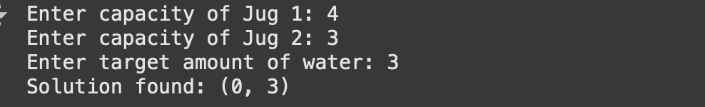
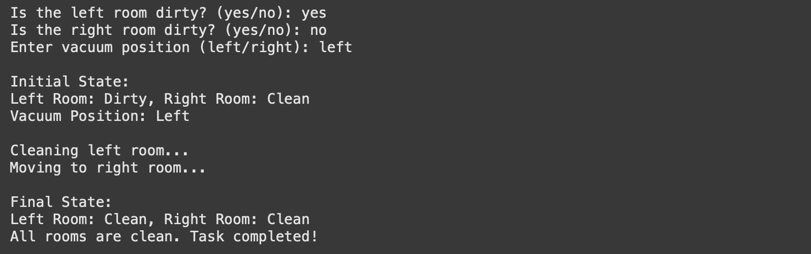
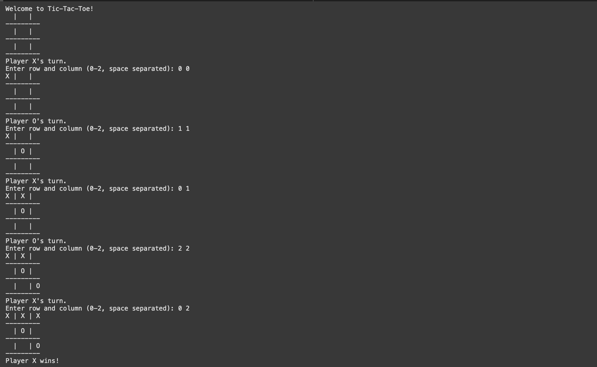

# AINNlabworks4

# Lab #4: Familiarization with AI programming in python.

## Objectives:

- Solve the water jug problem in python
- solve the vacuum world problem in python
- Be familiar with the Tic-Tac-Toe(Human vs AI) in python
  
 ## Background Theory

 Focusing on a few essential areas, like data structures, control structures, and modular programming, is crucial to understanding Python programming. These ideas serve as the foundation for creating Python programs that are clear, effective, and useful. A thorough summary of these core ideas can be found below.
 1. Data Structure:
    
     1.1. List:
    
        A list is an ordered, mutable (changeable) collection of elements.
         Lists can hold items of different data types and can be 
        changed by adding, removing, or modifying elements.
        Syntax: Lists are created using square brackets [] 

     1.2.Tuple:
    
        A tuple is similar to a list, but it is immutable, meaning once created,
        the elements of a tuple cannot be changed. 
        Tuples are typically used for fixed collections of items.
        Syntax: Tuples are created using parentheses ()
    
    1.3.Dictionary:

        A dictionary is an unordered collection of key-value pairs.
        Each key in the dictionary must be unique. 
        Dictionaries are very efficient for retrieving, adding, and removing items based on a unique key.
        Syntax: Dictionaries are created using curly braces {}
    
2.Control Structure in Python:

Control structures allow a program to execute specific code blocks based on conditions or repeat code multiple times. They provide the logic and flow control for a program.

  2.1. Conditional Statement

  Conditional statements let you make decisions based on certain conditions.
  Python uses if, elif, and else statements for conditional logic.
      
      if condition:
        # Code block
      elif condition:
        # Code block
      else:
        # Code block

  2.2. Loops
  
  Loops allow a program to repeat a block of code multiple times.

 For Loop: A for loop iterates over a sequence (like a list, string, or range) and executes a block of code for each element.

     for i in range():

While Loop: A while loop runs as long as a specified condition is True.

  example
  
      x = 0
      while x < 5:
      print(x)
    x += 1
    Output: 0 1 2 3 4

#Break and Continue

break: Exits the loop prematurely.

continue: Skips the current iteration and continues to the next iteration.

3. Modular programming in python
 - Functions: Reusable blocks of code.
   
       def function_name(parameter1, parameter2):
         # Code block
       return result
     
 - Parameters and Arguments: Values passed to functions.
 - Return values: Functions can return results.
 - Scope: Local and global variable access.
    
## Procedure
1. For water jug problem  
    1.1 Observe the current water levels in both jugs.  
    1.2 If the goal amount is reached in any jug, stop. 
    1.3 Fill a jug to its maximum capacity if needed.
    1.4 Empty a jug if necessary to make space. 
    1.4 Transfer water from one jug to another until the goal is reached. 
    1.5 Repeat steps until the desired water quantity is obtained. 
    1.6 Stop once the goal is achieved. 

2. Vaccum world PRoblem 
   2.1 Observe the current room's condition (Clean/Dirty). 
   2.2 If the room is dirty, perform the Suck action to clean it. 
   2.3 Move to the next room (Left or Right). 
   2.4 Repeat the process until all rooms are clean. 
   2.5 Stop once the goal is achieved. 

3. Tic-Tac-toe 
   3.1 Observe the current state of the board.
   3.2 Check if there is a winning move and play it. 
   3.3 If no winning move, block the opponent’s winning move if possible. 
   3.4 If neither, play an optimal strategic move (center, corner, or edge). 
   3.5 Alternate turns between players until the board is full or a player wins. 
   3.6 Stop when there is a winner or the game ends in a draw. 

## Output
Output 1: 
  
Output 2: 
  
Output 3: 

## Conclusion

The Water Jug Problem,Vacuum World Problem and Tic-Tac-Toe are classic examples that introduce fundamental concepts of artificial intelligence, problem-solving, and decision-making. The Water Jug Problem showcases constraint satisfaction and systematic exploration techniques such as breadth-first search (BFS) to find the optimal solution for achieving a target water level. The Vacuum World Problem demonstrates a simple reflex-based agent that senses its environment and performs cleaning actions until the goal state is achieved, highlighting perception-action cycles in AI. On the other hand, Tic-Tac-Toe is a strategic two-player game that illustrates decision-making, turn-based play, and win conditions, emphasizing concepts like optimal moves and game strategies. Collectively, these problems provide a foundational understanding of problem-solving approaches, logical thinking, and state-space exploration, serving as an excellent starting point for learning AI and programming principles.
