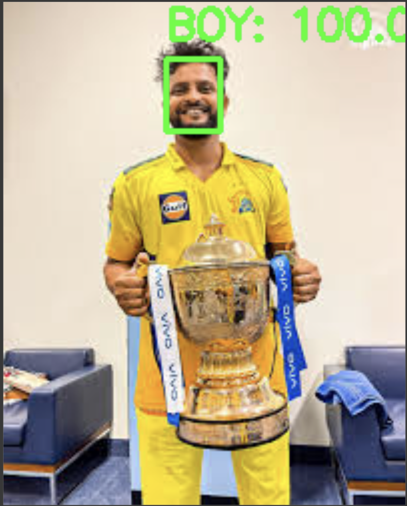

## Title: Gender Classification using OpenCV and Pre-Trained Deep Learning Model
 # Objectives:
    1. Find a pre-trained CNN model suitable for gender classification.
    2. Load the pre-trained model and test images into Google Colab.
    3. Perform data preprocessing to prepare the images for the model.
    4. Predict the gender of the individuals in the test images.
    
# Background Theory:
 Classical ML vs Deep Learning: 
       Classical Machine Learning (ML): Involves manually extracting features from raw data (like images) and then training a machine 
  learning model (like SVM, Decision Trees) on those features.

 Deep Learning:
     A subfield of machine learning where the algorithm automatically learns features from data, especially in tasks such as image and 
  speech recognition. Convolutional Neural Networks (CNNs) are a class of deep learning models used for image classification tasks.

Convolutional Neural Networks (CNN):
     CNNs are a specialized type of neural network for processing structured grid data, such as images. CNNs are composed of 
  convolutional layers, pooling layers, and fully connected layers. These networks automatically learn features like edges, textures, and 
   patterns in the data, making them ideal for tasks like image classification.

# Procedure
  1. Folder was created on google drive to put .ipynb file.
  2. .ipynb file was added and opened with Google Collab.
  3. Code was added and run block wise.
  4. Before testing image folder was created in folder that was cloned and .jpg file was added.
  5. Finally, after testing result was obtained.

# Output
 
 
# Conclusion:
In this lab, we successfully used OpenCV and a pre-trained deep learning model to perform gender classification on test images. By loading a pre-trained CNN model and preprocessing the images appropriately, we were able to predict the gender of the individual in the image with high accuracy. This task showcases how deep learning models can be applied to real-world problems such as image classification, with OpenCV serving as an essential tool for image manipulation and preprocessing.
