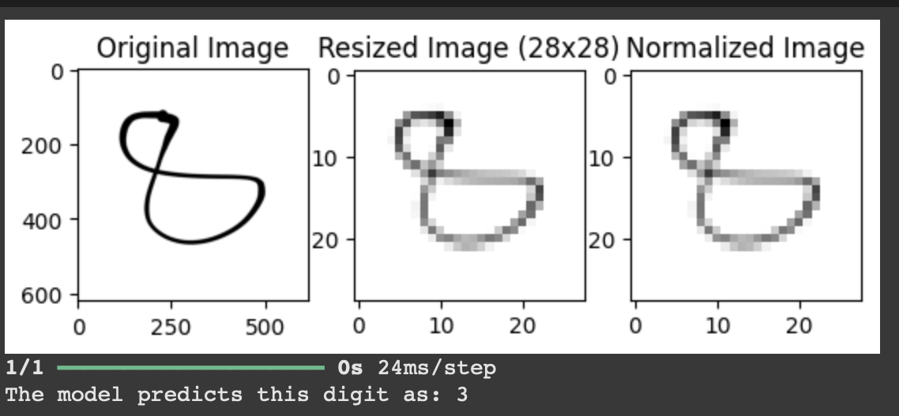
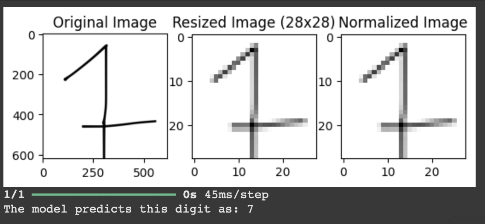

# Title : Training an Artificial Neural Network
## Objectives:
1. Import libraries & load the MNIST dataset.
2. Build an artificial neural network model.
3. Compile & train the model.
4. Train the model.
5. Evaluate & visualize the model.
   
## Background Theory:
### Artificial Neural Network
An Artificial Neural Network (ANN) is a computational model inspired by the way biological neural networks in the human brain work. It consists of nodes (neurons) connected by edges (synapses). These networks are designed to recognize patterns, classify data, and make predictions by learning from the input data. ANNs are used in various applications like image recognition, natural language processing, and predictive analytics. 

Key components of ANN: 

Neurons: The basic computational units of the network that receive input, process it, and produce output.  
Weights: Parameters that control the strength of connections between neurons.   
Bias: A constant value added to the weighted sum of inputs to shift the activation function.  
Activation Function: A mathematical function that determines the output of a neuron, based on its inputs. Common activation functions include Sigmoid, ReLU (Rectified Linear Unit), and Tanh. 
 
### Layers in ANN

ANNs are typically structured into layers: 

Input Layer: The first layer of the network, where input features are fed into the network.  
Hidden Layers: Layers between the input and output layers that perform computations. There can be one or more hidden layers in an ANN.  
Output Layer: The final layer that produces the output of the network based on the computations from the previous layers. 

### Multilayer Perceptron

A Multilayer Perceptron (MLP) is a type of feedforward artificial neural network that consists of multiple layers of neurons: 

Feedforward Network: In MLP, the information moves in one direction—from the input layer, through hidden layers, and to the output layer—without any loops. 
Fully Connected: Each neuron in a layer is connected to every neuron in the previous and subsequent layers. 
Non-Linearity: MLPs typically use non-linear activation functions (e.g., ReLU, Sigmoid) to model complex relationships. 
MLPs are often used for supervised learning tasks such as classification and regression. 

### Forward Pass & Back Propagation
 
Forward Pass: 
During the forward pass, the input data is passed through the network layer by layer. At each layer, the data is processed using weights and activation functions, and the output is passed to the next layer. 
This process continues until the output layer produces the final prediction or output. 

Backpropagation: 

Backpropagation is a training algorithm used to minimize the error in an ANN by adjusting the weights and biases. It works by computing the gradient of the loss function with respect to each weight in the network. 
Error Calculation: The difference between the predicted output and the actual output (ground truth) is calculated (usually using a loss function like mean squared error or cross-entropy). 
Gradient Descent: The network then uses an optimization technique like gradient descent to adjust the weights to minimize the loss function. 

### The tensorflow & Keras Libraries
 
TensorFlow: 

TensorFlow is an open-source machine learning framework developed by Google. It allows for efficient computation and deployment of machine learning models, especially neural networks. 
It is widely used for deep learning tasks and supports various neural network architectures, including CNNs (Convolutional Neural Networks) and RNNs (Recurrent Neural Networks). 
TensorFlow can run on both CPUs and GPUs, enabling faster training of large models.

Keras: 

Keras is a high-level neural network API that runs on top of TensorFlow (or other frameworks like Theano and Microsoft Cognitive Toolkit). It simplifies the process of building, training, and evaluating neural networks. 
Keras provides easy-to-use methods for defining layers, activation functions, and models. It is particularly popular due to its user-friendly interface and flexibility. 
Common functions in Keras include Sequential() for building models layer by layer and Model.compile()for setting up the training configuration. 

## Procedure
1. Folder was created on google drive to put .ipynb file.
2. .ipynb file was added and opened with Google Collab.
3. Code was added and run block wise.
4. Before testing image dataset folder was created and testing images file were added.
5. Finally, after testingc the image, result was obtained.

## Output

## Conclusion
In this session, we have learned to build the network using TensorFlow and Keras to classify images from the MNIST dataset and finally observed the specific output.
 
 

