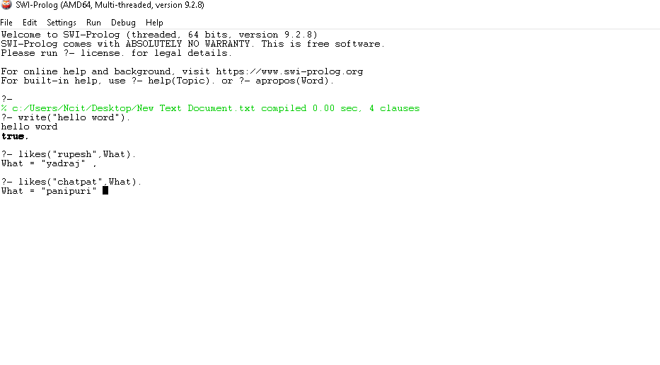

#AINNlabworks2
# Lab #2: Familiarization with logic programming(in prolog).

## Objectives:
            -Download and install prolog.
            -print hello world.
            -Load/consult a knowledge.

## Background Theory - 
**Programing Paradigm**: Formal logic is the main emphasis of logic programming. It draws conclusions based on rules and evidence.  
**Logic Programming**: This type of programming involves defining *what* should be done rather than *how* to achieve it. In this paradigm, Prolog is a widely used language.  
**SWI-Prolog**: An open-source, free Prolog environment that is frequently used for logic programming education and training.  

## procedure:

## Step 1: **Installation** - Get SWI-Prolog from [SWI-Prolog](https://www.swi-prolog.org/), the program's official website.  
   - Comply with your operating system's installation guidelines.  

2. **Hello Prolog World**:  
   Launch SWI-Prolog.  
   In the terminal, type the following:  
     ```prolog?-write('Hello World'), nl. ```
    - Press Enter to see the output.  

3. **Load/Consult a Knowledge Base**:  
   - Create a Prolog file (`New Text Document.txt`) with the following content:  
     ```prolog
     likes(rupesh, yadraj).
     likes(rupesh, chatpat).
     ```
   - Load it in SWI-Prolog using:  
     ```prolog
     ?- consult('New Text Document.txt').
     ```  
   - Test it with queries like:  
     ```prolog
     ?- likes("rupesh",What).
     ```
   - Test it with queries like:  
     ```prolog
     ?- likes("chatpat",What).
     ```  

## Output  
1. **hello word**: The output should display as:
2. Output of querie, "likes("rupesh",What)" should display as:- **What = "yadraj"**
3. Output of querie, "likes("chatpat",What)" should display as:- **What = "panipuri"**
 


  

